# 🏨 Nur-e-Haya — Enterprise Hotel Management SaaS

A full-stack, enterprise-grade Hotel Management SaaS platform built with **Python (Flask)**, **Firebase Firestore**, and a custom **Glassmorphism & Gold Luxury Design System** powered by **Bootstrap 5**.

---

## 🌟 Key Highlights & Architecture

- **Multi-Role RBAC (10 Roles)**: Built-in role-based access control for `Super Admin`, `Admin`, `Front Desk`, `Housekeeping`, `Laundry`, `Room Service`, `Kitchen (KDS)`, `Maintenance`, `Security`, and `Guest`.
- **Automated Workflows**:
  - Front Desk check-out automatically creates a Housekeeping turnover task.
  - Resolving a maintenance ticket automatically lifts room maintenance blocks in Firestore.
  - Room Service orders route live to the Kitchen Display System (KDS).
- **Transient UI & Resilient Conventions**: Standardized 5-state UI (Loading shimmer, Empty state, Error retry, Toast alerts, and Permission-Denied handlers) with uniform `{ ok: true, data }` API envelopes.
- **AI Concierge Chatbot**: Integrated guest concierge powered by an automated knowledge base for inquiries and room reservations.

---

## 📸 Visual Showcase & Screen Gallery

### 1. Guest Discovery & Public Authentication
| Public Sign In (`/login`) | Guest Registration (`/signup`) |
| :---: | :---: |
| 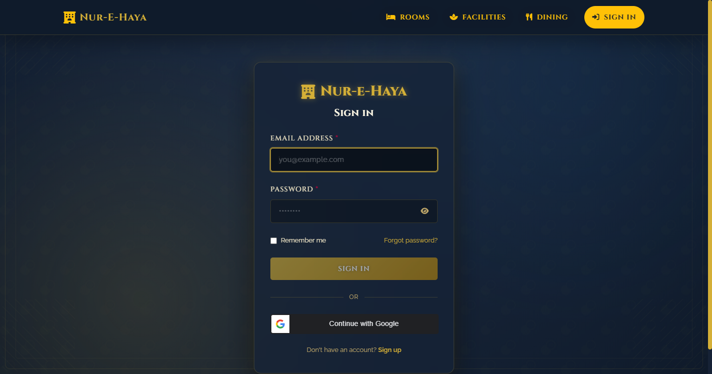 | 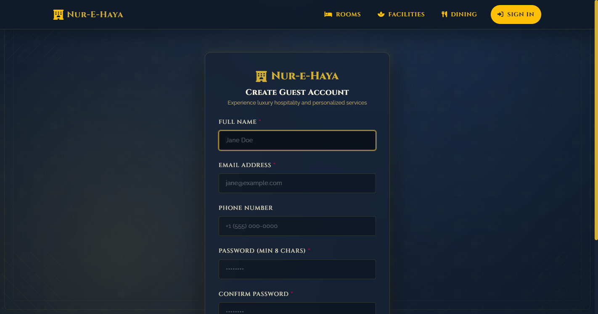 |

| Luxury Rooms & Suites (`/rooms`) | Fine Dining & Room Service (`/menu`) |
| :---: | :---: |
| 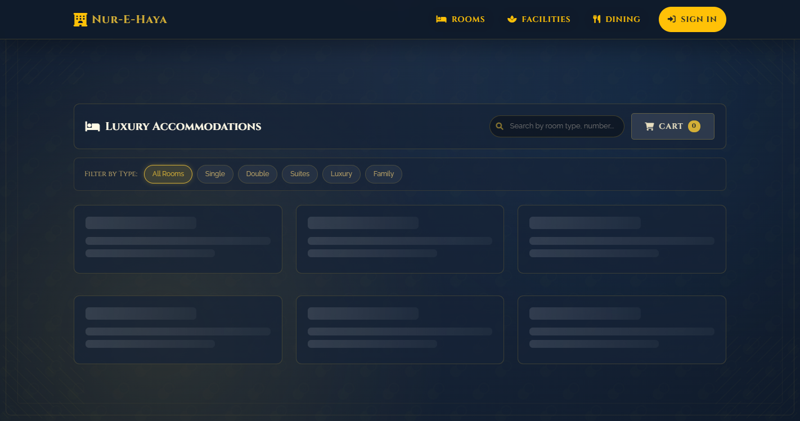 | 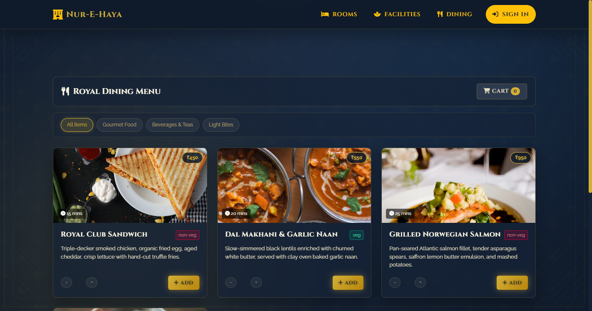 |

---

### 2. Front Desk & Operational Queues
| Front Desk Live Room Status Board (`/staff/front-desk/rooms`) | Housekeeping Kanban Turnover Board (`/staff/housekeeping`) |
| :---: | :---: |
| 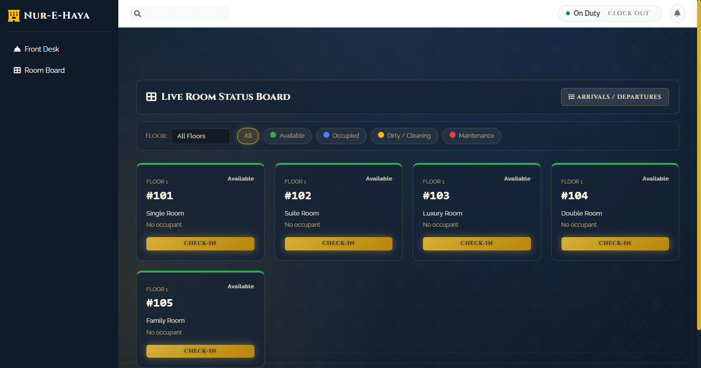 | 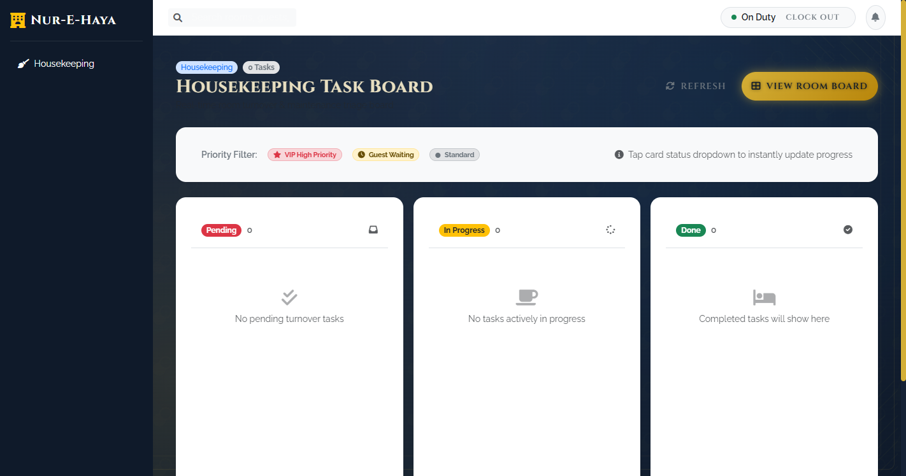 |

| Kitchen Display System (KDS) (`/staff/kitchen`) | Maintenance Ticket Queue (`/staff/maintenance`) |
| :---: | :---: |
| 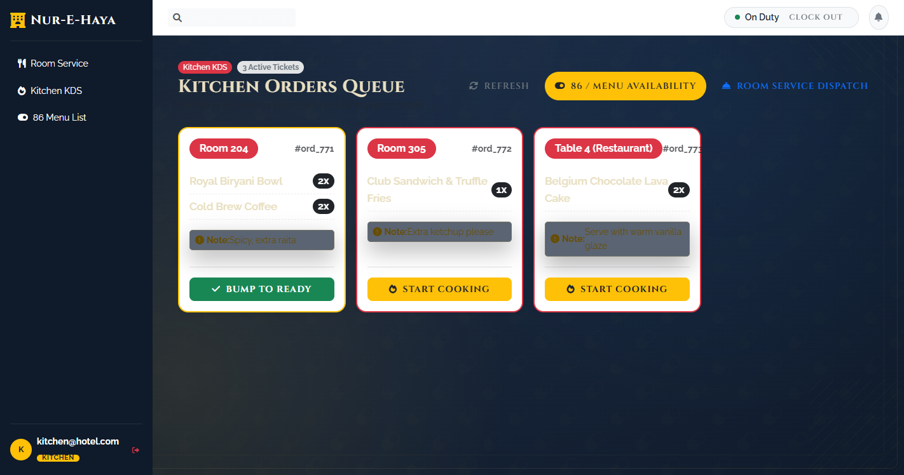 | 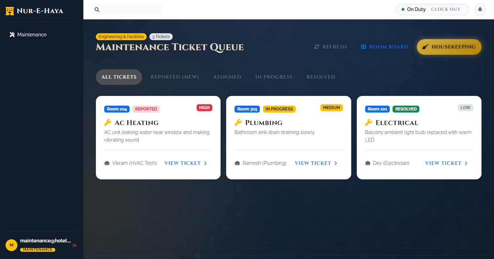 |

---

### 3. Management, BI & Global Platform Configuration
| Management Command Center (`/admin`) | Revenue Analytics & BI (`/admin/revenue`) |
| :---: | :---: |
| 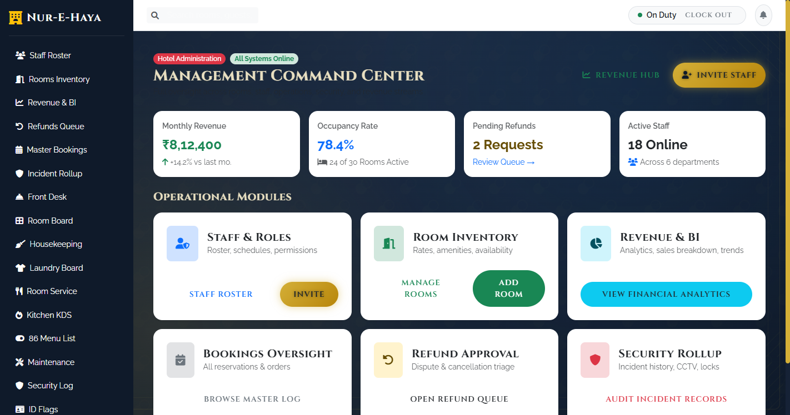 | 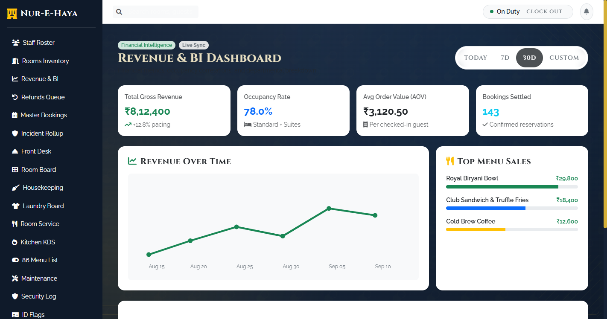 |

| Super Admin Global Settings (`/super-admin/settings`) | Security Incident Log (`/staff/security`) |
| :---: | :---: |
| 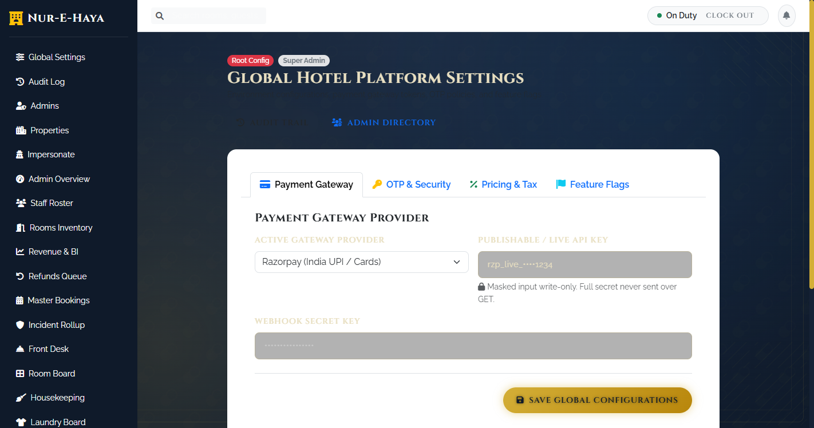 | 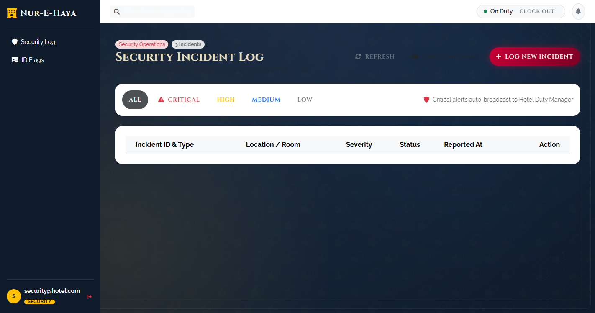 |

---

## 🚀 Quick Start Guide

### 1. Prerequisites
- **Python 3.10+** (Tested on Python 3.10 and 3.11)
- **Firebase Project** with Firestore Database enabled
- Git

### 2. Clone the Repository
```bash
git clone https://github.com/DraculaHub786/Hotel-Management-System-firebase.git
cd "Hotel Management System firebase"
```

### 3. Set Up a Virtual Environment

**On Windows (PowerShell):**
```powershell
python -m venv venv
.\venv\Scripts\Activate.ps1
```

**On macOS / Linux:**
```bash
python3 -m venv venv
source venv/bin/activate
```

### 4. Install Dependencies
```bash
pip install -r requirements.txt
```

### 5. Configure Environment Variables
Copy `.env.example` to `.env` or configure your credentials:
```bash
cp .env.example .env
```

Ensure your `.env` contains:
```env
FLASK_ENV=development
PORT=5000
SECRET_KEY=your_secure_hex_key_here
FIREBASE_CREDENTIALS_PATH=firebase-credentials.json
```

> **Firebase Credentials**: Place your Firebase service account JSON in the project root as `firebase-credentials.json`, or set `FIREBASE_CREDENTIALS_JSON` / `FIREBASE_CREDENTIALS_BASE64` in `.env`.

---

## 🏃 Running the Application

Start the Flask server:
```bash
python app.py
```

The application will start on:
- **Local URL**: `http://127.0.0.1:5000`
- **Network URL**: `http://localhost:5000`

---

## 🛡️ Role-Based Routes & Access Summary

| Module | Route | Accessible Roles | Features |
| :--- | :--- | :--- | :--- |
| **Public** | `/` or `/login` | Public | Glassmorphic Sign In & Google Authentication |
| **Guest** | `/dashboard` | Guest | My Reservations, Bookings History, AI Concierge |
| **Rooms** | `/rooms` | Public / Guest | Room inventory, amenity filters, real-time booking |
| **Dining** | `/menu` | Public / Guest | Kitchen menu items, dietary filters, cart integration |
| **Front Desk** | `/staff/front-desk/rooms` | Front Desk, Admin | Color-coded status grid, instant check-in/out |
| **Housekeeping**| `/staff/housekeeping` | Housekeeping, Admin| Kanban turnover tasks (Pending &rarr; In Progress &rarr; Done) |
| **Laundry** | `/staff/laundry` | Laundry, Admin | Wash & delivery tracking queue |
| **Room Service**| `/staff/room-service` | Room Service, Admin | Delivery dispatched orders & OTP handoff |
| **Kitchen** | `/staff/kitchen` | Kitchen, Admin | Live KDS tickets & 86/availability toggle switch |
| **Maintenance**| `/staff/maintenance` | Maintenance, Admin | Plumbing/HVAC triage & automatic room unblocking |
| **Security** | `/staff/security` | Security, Admin | Incident logging, severity tags & ID verification flags |
| **Admin** | `/admin` | Admin, Super Admin | Executive dashboard, revenue BI, staff roster, refunds |
| **Super Admin** | `/super-admin/settings`| Super Admin | Payment gateways, OTP length, audit logs, impersonation |

---

## 🧪 Running Automated Tests

Run the built-in test suites:
```bash
# Test UI conventions and API envelopes (Section A)
python test_section_a.py

# Test Auth and Token Handlers (Section B)
python test_section_b.py
```

---

## 📁 Project Structure

```
├── app.py                      # Core Flask application and REST API endpoints
├── chatbot.py                  # AI Concierge & Chatbot engine
├── guest_service.py            # Pricing calculations, QR generator, seed data
├── api_utils.py                # Standard API envelope helpers & RBAC decorators
├── static/
│   ├── css/conventions.css     # Luxury dark & gold UI tokens, shimmer, toast styles
│   └── js/conventions.js      # AppAPI, Toast, AppStates, and AppForm validators
├── templates/
│   ├── base.html               # Master shell layout with role-filtered sidebar
│   ├── login.html              # Authentication screen
│   ├── signup.html             # Guest registration
│   ├── admin/                  # Administrative and BI dashboards
│   ├── frontdesk/              # Room status board & arrival/departure lists
│   ├── guest/                  # Guest catalog, cart, checkout, and portal
│   ├── housekeeping/           # Housekeeping Kanban board
│   ├── kitchen/                # Kitchen Display System & 86 menu management
│   ├── laundry/                # Laundry cycle board
│   ├── maintenance/            # Ticket queue & repair detail
│   ├── room_service/           # Order dispatch queue
│   ├── security/               # Incident logging & ID flags
│   └── super_admin/            # Global platform configuration & audit trails
├── screenshots/                # Application screen captures
└── requirements.txt            # Python dependencies
```

---

## 📄 License
This project is open-source under the [MIT License](LICENSE).
